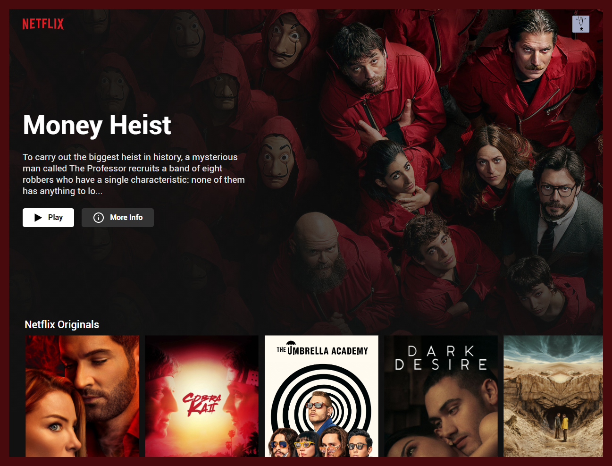
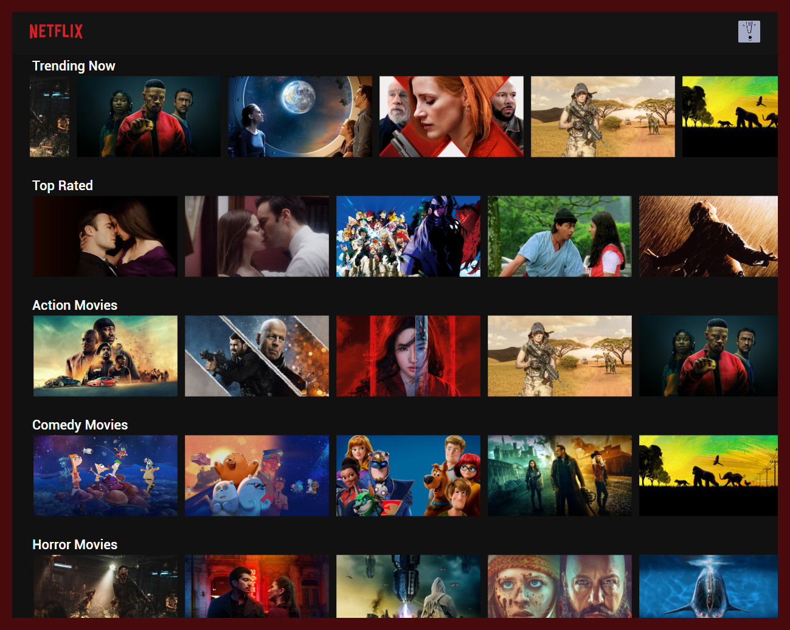

# UI Clone | Netflix

A UI clone of the Netflix Home page website.

[](https://app.netlify.com/sites/pensive-snyder-46bc57/deploys)

## Demo



---



## Get Started

Follow the steps below to properly run this application.

#### Clone the repository:

```bash
git clone https://github.com/gasscoelho/uiclone-netflix-web.git
```

```bash
cd uiclone-netflix-web
```

#### Start the application:

```bash
yarn install
```

```bash
yarn start
```

*You can also use NPM instead of YARN to install the dependencies and start the application.*

## Built With

✨ ReactJS <br />
✨ TypeScript <br />
✨ Styled-Components <br />
✨ React-Icons & more! <br />

## Author

**[Gabriel Coelho](https://gasscoelho.me/en)** - Software Engineer
